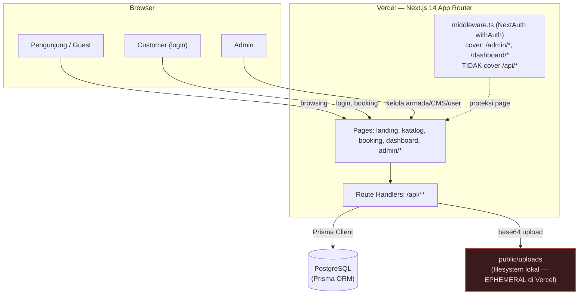
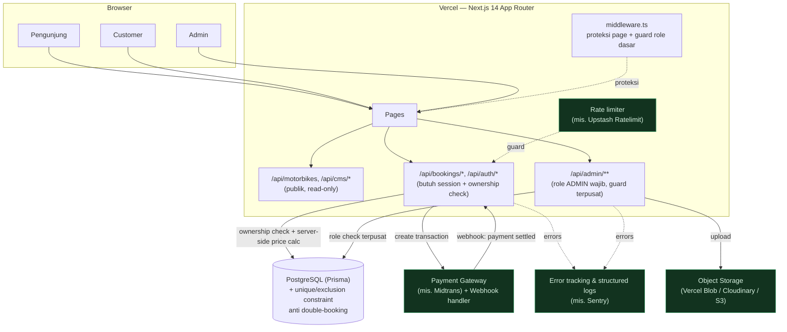
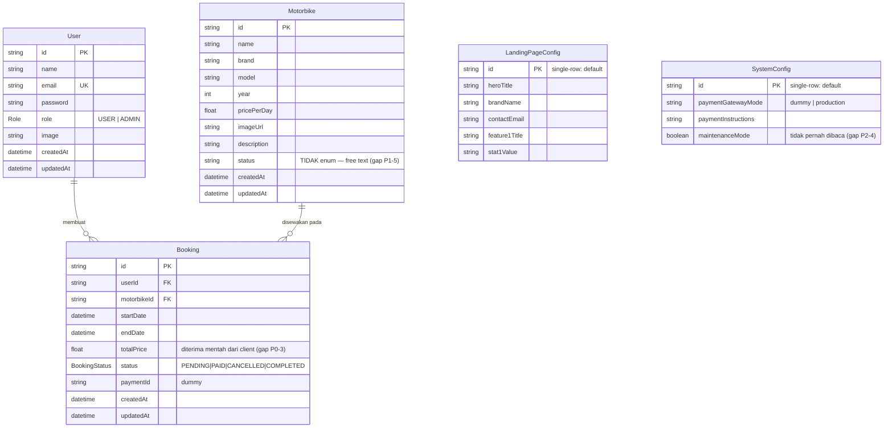
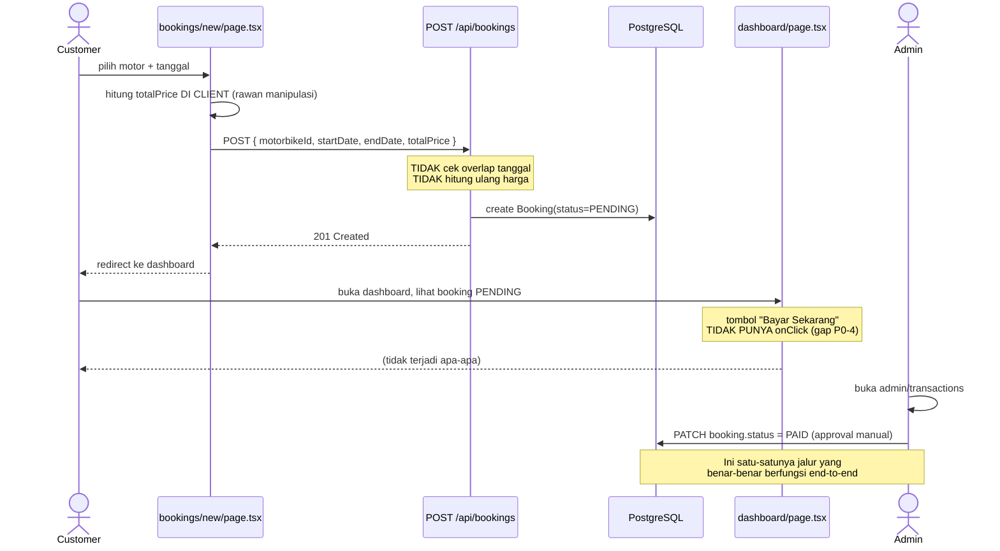
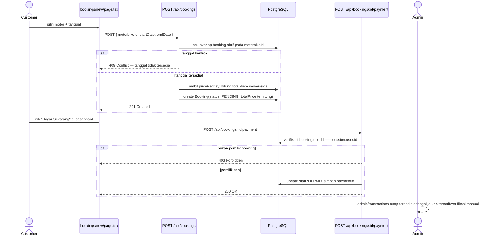
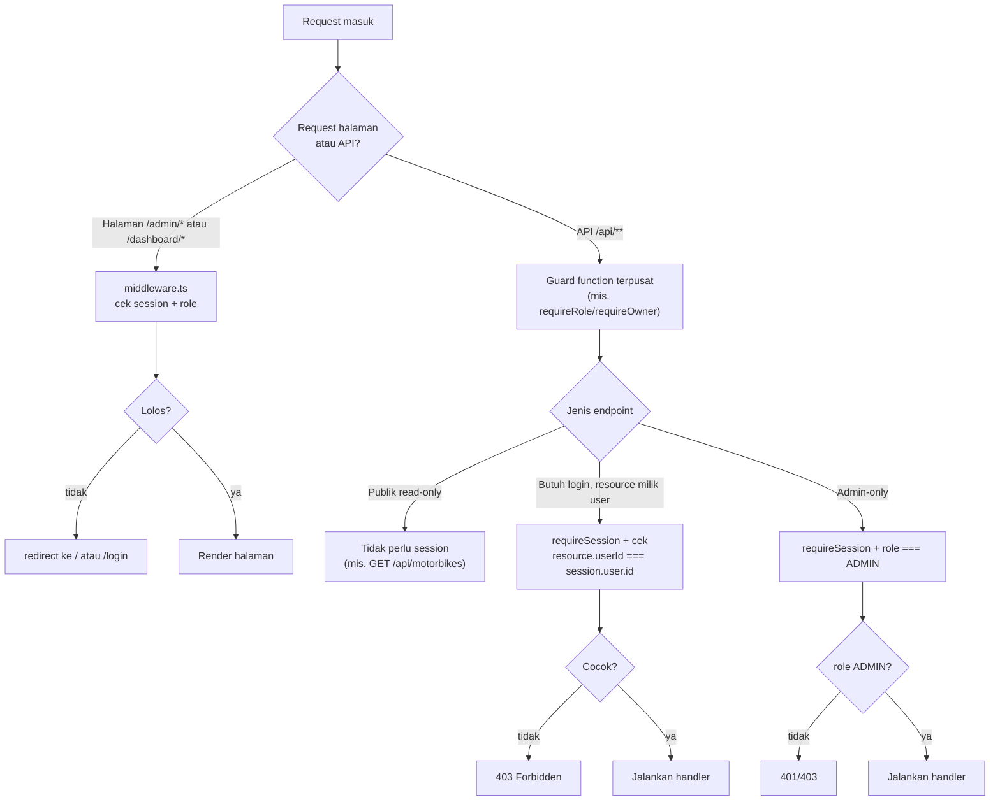

# Architecture & Diagrams — SewaMotor Platform

> Diagram di dokumen ini pakai sintaks [Mermaid](https://mermaid.js.org/) — akan render otomatis di GitHub, GitLab, VS Code (dengan ekstensi Mermaid), dan sebagian besar viewer Markdown modern.
> Dokumen terkait: [PRD](./PRD.md) · [Gap Analysis](./GAP-ANALYSIS.md) · [Roadmap](./ROADMAP.md)

## 1. System Context (kondisi saat ini)



**Catatan arsitektur kondisi saat ini:**
- `middleware.ts` hanya melindungi **halaman** (`/admin/*`, `/dashboard/*`), bukan `/api/*` — proteksi API dilakukan manual per-route dan **tidak konsisten** (lihat GAP P1-2).
- Penyimpanan file upload memakai filesystem lokal container Vercel yang **ephemeral** — bukan solusi produksi (GAP P1-4).
- Belum ada payment gateway eksternal, object storage, email/notification service, atau observability service tersambung.

## 2. Target Architecture (setelah Roadmap Fase 0-3)



## 3. Entity Relationship Diagram (skema aktual)



**Entity yang belum ada tapi dibutuhkan untuk fitur yang sudah "terlihat" di UI** (lihat GAP P2-8): `Review`/`Rating`, `PaymentTransaction` (log detail, terpisah dari `Booking.paymentId`), `Notification`, `AuditLog`.

## 4. Sequence — Alur Booking & Pembayaran (kondisi saat ini, ada gap)



## 5. Sequence — Alur Booking & Pembayaran (target setelah Roadmap Fase 1)



## 6. Authorization Flow (target — guard terpusat)



## 7. Deployment View

```mermaid
flowchart LR
    Dev["Developer\n(local, .env dari .env.example)"] -->|git push| GitHub["GitHub repo\njoeinus134131/motorbike-rental"]
    GitHub -->|CI: lint, typecheck, test\n(Roadmap Fase 4)| CI["GitHub Actions"]
    CI -->|deploy| Vercel["Vercel Production"]
    Vercel --> DB[("Managed PostgreSQL\n(Vercel Postgres/Neon/Supabase, dsb)")]
    Vercel --> Blob["Object Storage"]
    Vercel --> Payment["Payment Gateway"]

    subgraph EnvVars["Environment Variables (Vercel Project Settings, BUKAN di git)"]
        E1["DATABASE_URL"]
        E2["DIRECT_URL"]
        E3["NEXTAUTH_SECRET (rotated)"]
        E4["NEXTAUTH_URL"]
        E5["Payment gateway keys"]
        E6["Object storage token"]
    end
    Vercel -.baca dari.-> EnvVars
```
