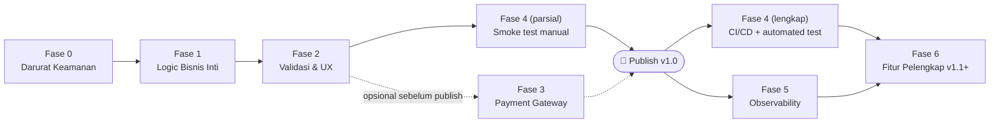

# Roadmap Implementasi — SewaMotor Platform

> Urutan eksekusi bertahap menuju [Definition of Done "Siap Publish"](./PRD.md#8-definition-of-done--siap-publish). Setiap fase dirancang agar aplikasi tetap berjalan di akhir fase (tidak ada fase yang meninggalkan aplikasi dalam kondisi rusak/setengah jadi).
> Effort: **S** = < 0.5 hari, **M** = 0.5–2 hari, **L** = > 2 hari (perkiraan kasar untuk 1 developer).

## Ringkasan Fase

| Fase | Fokus | Wajib sebelum publish? |
|---|---|---|
| 0 | Darurat keamanan | **Ya, prioritas #1** |
| 1 | Kebenaran logic bisnis inti | **Ya** |
| 2 | Validasi & UX yang nyambung | Sangat direkomendasikan |
| 3 | Payment gateway sungguhan | Opsional v1.0 (lihat [ADR-0003](./adr/0003-payment-gateway-strategy.md)) |
| 4 | Testing & CI/CD | Direkomendasikan sebelum publish, minimal smoke test |
| 5 | Observability & Ops | Bisa menyusul v1.0.1 |
| 6 | Fitur pelengkap | v1.1+ |

---

## Fase 0 — Darurat Keamanan (lakukan lebih dulu, sebelum menyentuh fase lain)

**Tujuan**: menghentikan pendarahan aktif — secret bocor, IDOR, endpoint tanpa auth.

| Tugas | Ref | Effort |
|---|---|---|
| Rotate `NEXTAUTH_SECRET` & credential database (tindakan manual Anda) | [ADR-0002](./adr/0002-secret-leak-remediation.md) | S |
| `git rm --cached .env`, tambahkan `.env` ke `.gitignore`, buat `.env.example` | [ADR-0002](./adr/0002-secret-leak-remediation.md) | S |
| Perbaiki IDOR di `POST /api/bookings/[id]/payment` — tambah ownership check | [ADR-0006](./adr/0006-api-authorization-hardening.md), GAP P0-2 | S |
| Tambah auth check di `GET /api/admin/motorbikes`, buat endpoint publik terpisah `GET /api/motorbikes` | [ADR-0006](./adr/0006-api-authorization-hardening.md), GAP P1-2 | M |
| Buat helper `requireAdmin()` / `requireOwnerOrAdmin()`, audit ulang semua route `/api/**` untuk memakainya | [ADR-0006](./adr/0006-api-authorization-hardening.md) | M |

**Exit criteria**: tidak ada credential valid di git; tidak ada endpoint yang bisa mengubah data milik user lain; setiap endpoint `/api/admin/*` menolak non-admin.

---

## Fase 1 — Kebenaran Logic Bisnis Inti

**Tujuan**: alur booking-bayar-approve benar-benar bisa diselesaikan end-to-end dan tidak bisa dimanipulasi.

| Tugas | Ref | Effort |
|---|---|---|
| Hitung ulang `totalPrice` di server dari `pricePerDay × durasi`, abaikan nilai dari client | [ADR-0005](./adr/0005-centralized-validation-with-zod.md), GAP P0-3 | M |
| Tambah pengecekan overlap tanggal booking dalam transaction sebelum create | [ADR-0007](./adr/0007-booking-concurrency-control.md), GAP P1-1 | M |
| Sambungkan tombol "Bayar Sekarang" di dashboard ke endpoint payment | GAP P0-4 | S |
| Sambungkan tombol "Detail Booking" di dashboard | GAP #12 | S |
| Ubah `Motorbike.status` jadi enum Prisma (`AVAILABLE`, `MAINTENANCE`, `RENTED`) + migration | GAP P1-5 | M |
| Perbaiki link "Semua Transaksi" di `admin/page.tsx` → `/admin/transactions` | GAP P2-2 | S |

**Exit criteria**: smoke test manual (register → browse → booking → bayar → admin lihat status PAID) berjalan tanpa langkah yang buntu; harga & ketersediaan tidak bisa dimanipulasi dari client.

---

## Fase 2 — Validasi & UX yang Nyambung

**Tujuan**: tidak ada lagi fitur yang terlihat ada di UI tapi sebenarnya palsu/tidak lengkap; error message informatif.

| Tugas | Ref | Effort |
|---|---|---|
| Definisikan zod schema per entity (`auth`, `booking`, `motorbike`, `cms`) di `src/lib/validations/` | [ADR-0005](./adr/0005-centralized-validation-with-zod.md) | M |
| Terapkan zod validation di semua Route Handler yang menerima body | [ADR-0005](./adr/0005-centralized-validation-with-zod.md) | L |
| Migrasi form (register, booking, motorbike, CMS) ke `react-hook-form` + `zodResolver`, ganti `alert()` generik dengan pesan per-field | [ADR-0005](./adr/0005-centralized-validation-with-zod.md), GAP P2-1, P2-6 | L |
| Validasi MIME type & ukuran file di `api/upload/route.ts` | GAP P1-3 | S |
| Pindahkan upload gambar ke object storage (Vercel Blob/pilihan Anda) | [ADR-0004](./adr/0004-file-storage-strategy.md), GAP P1-4 | M |
| Adopsi `next/image` + `images.remotePatterns` di `next.config.mjs` | GAP P2-5 | M |
| Wire up form kontak ke API sungguhan (simpan ke DB atau kirim email), atau tandai eksplisit "Coming Soon" bila belum jadi prioritas | GAP P2-3 | M |
| Tambah fitur demote/nonaktifkan user + guard admin terakhir | GAP P2-7 | M |
| Putuskan nasib `SystemConfig.maintenanceMode`: wire up ke middleware, atau hapus field jika tidak jadi dipakai | GAP P2-4 | S |

**Exit criteria**: semua item Should-have (FR-13–FR-16) di [PRD](./PRD.md) selesai.

---

## Fase 3 — Payment Gateway Sungguhan (kondisional, lihat ADR-0003)

**Tujuan**: pembayaran otomatis tanpa approval manual admin.

| Tugas | Ref | Effort |
|---|---|---|
| Pilih & daftar akun Midtrans (atau gateway pilihan Anda), setup sandbox | [ADR-0003](./adr/0003-payment-gateway-strategy.md) | S |
| Tambah tabel `PaymentTransaction`, extend `BookingStatus` (`EXPIRED`, `FAILED`, `REFUNDED`) | [ADR-0003](./adr/0003-payment-gateway-strategy.md) | M |
| Implementasi create transaction (Snap/Core API) dari `POST /api/bookings/[id]/payment` | [ADR-0003](./adr/0003-payment-gateway-strategy.md) | L |
| Implementasi webhook handler dengan verifikasi signature, idempoten terhadap notifikasi duplikat | [ADR-0003](./adr/0003-payment-gateway-strategy.md) | L |
| Update UI dashboard untuk menampilkan status transaksi real-time (redirect ke Snap page, polling/callback status) | [ADR-0003](./adr/0003-payment-gateway-strategy.md) | M |

**Exit criteria**: customer bisa bayar via metode pembayaran nyata (QRIS/VA/e-wallet) tanpa campur tangan admin, status booking update otomatis dari webhook.

---

## Fase 4 — Testing & CI/CD

**Tujuan**: perubahan ke depan tidak diam-diam merusak alur kritis.

| Tugas | Effort |
|---|---|
| Setup test runner (Vitest/Jest) + script `test` di `package.json` | S |
| Test integrasi untuk endpoint kritis: booking creation (overlap & price recalc), payment ownership check, auth role guard | M |
| Test E2E minimal (Playwright) untuk alur: register → login → booking → bayar → admin approve | L |
| Setup GitHub Actions: lint + typecheck + test di setiap PR | S |
| (Opsional) staging environment terpisah di Vercel untuk preview sebelum production | M |

**Exit criteria**: alur kritis (booking, payment, auth) tercakup test otomatis; CI jalan di setiap push/PR.

---

## Fase 5 — Observability & Ops

**Tujuan**: begitu live, masalah produksi bisa terdeteksi & didiagnosis cepat.

| Tugas | Effort |
|---|---|
| Integrasi error tracking (Sentry atau sejenis) untuk client & server | M |
| Structured logging di Route Handler (request ID, user ID, action) menggantikan `console.error` polos | M |
| Rate limiting di endpoint login/register/booking/upload (mis. Upstash Ratelimit) | M |
| Audit log aktivitas admin (siapa approve booking mana, siapa ubah role user) | M |

**Exit criteria**: ada visibilitas terhadap error produksi tanpa perlu akses manual ke server logs; endpoint sensitif terlindung dari abuse.

---

## Fase 6 — Fitur Pelengkap (v1.1+, di luar scope PRD v1.0)

- Sistem review & rating motor (perlu tabel `Review` baru — data rating "4.9" yang saat ini hardcoded di UI perlu diganti dengan data nyata atau dihapus dulu sebelum fase ini).
- Notifikasi email/WhatsApp (konfirmasi booking, reminder jatuh tempo).
- Refund flow.
- Multi-cabang/multi-lokasi armada.
- Reporting & analytics lanjutan.

---

## Urutan Kerja yang Disarankan

**Rekomendasi**: Fase 0 dan 1 dikerjakan berurutan tanpa jeda (keduanya blocking). Fase 2 bisa dicicil per-item sambil Fase 4 (smoke test manual) dijalankan paralel. Keputusan soal Fase 3 (payment gateway) menunggu jawaban Anda di [pertanyaan terbuka PRD](./PRD.md#10-pertanyaan-terbuka-untuk-anda-perlu-keputusan-sebelum-eksekusi-penuh).
